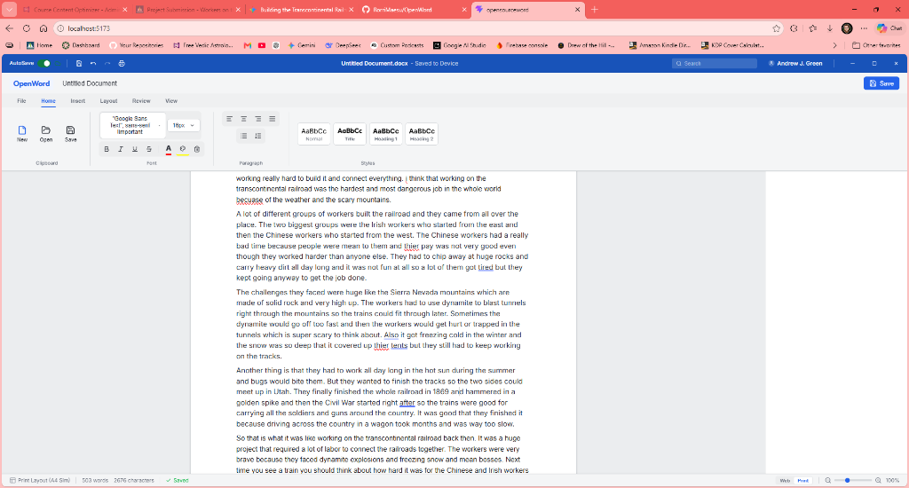

# 📝 OpenWord

OpenWord is a professional, high-fidelity, client-side word processor built with React, TypeScript, and Tiptap. It simulates a premium Microsoft Word desktop interface directly in your browser, featuring virtual pagination, dynamic margins, a responsive floating ribbon menu, auto-saving, and dark mode support.

[](https://rorrimaesu.github.io/OpenWord/)
[](https://buymeacoffee.com/rorrimaesu)
[](https://react.dev)
[](https://www.typescriptlang.org)
[](https://vite.dev)
[](LICENSE)

[](https://rorrimaesu.github.io/OpenWord/)

---

## 🚀 The Value Proposition: 100% Client-Side & Private

Unlike standard cloud word processors, OpenWord is an **offline-first, zero-server application**. 
*   **Privacy-First:** Your documents are never uploaded to any external server. All text processing, imports, database updates, and document compilation occur directly in your browser sandbox.
*   **No Accounts Needed:** Start drafting immediately. Your workspace recovers itself automatically on restart using client-side IndexedDB persistence.

---

## ✨ Features Breakdown

### 📁 Page Layout & Print Precision
*   **Virtual A4/Letter Pagination:** Visual page breaks that automatically calculate paragraph and node heights in real-time, inserting clean page lines exactly like a physical layout.
*   **Zoom-Scaled Margin Ruler:** Drag-and-drop margin handles to adjust left and right margins dynamically. The cursor tracking scales mathematically to match your current document zoom level.
*   **Dynamic Headers & Footers:** Set customized running header and footer text zones that automatically overlay relative to page margins.

### 🎨 Premium Desktop Aesthetics
*   **Auto-Collapsing Ribbon:** An interactive ribbon toolbar matching Microsoft Word's layout. It collapses into tabs automatically to maximize vertical reading space and slides open on hover.
*   **Direct Title Bar Renaming:** Edit the document filename directly inside the Windows-styled Title Bar input.
*   **Sidebar Navigation Outline:** Auto-updating outline list based on heading tags to navigate large documents quickly.
*   **Aesthetic Theme Selector:** Seamless light-to-dark canvas transition via the bottom Status Bar.

### 🔒 Client-Side Storage & IO
*   **IndexedDB Autosave:** Background saving to IndexedDB (v2) with an automatic session recovery dialog on startup.
*   **Zero-Server Exports:** Export documents directly to Microsoft Word `.docx` format using client-side XML packaging.
*   **Mammoth HTML Importer:** Import local document formats directly into the editor canvas.

---

## ⚙️ Architecture & Data Flow

OpenWord is designed to decouple Tiptap's rich-text events from our React rendering context for fluid editing performance:

```
                  +----------------------------------+
                  |       Tiptap/ProseMirror         |
                  +----------------------------------+
                                   |
                         (onUpdate Event / JSON)
                                   v
                  +----------------------------------+
                  |    React DocumentContext State   |
                  +----------------------------------+
                     /                            \
      (Debounced 5s Autosave)             (Debounced 150ms Break)
                   /                                \
                  v                                  v
  +-------------------------------+   +-------------------------------+
  |       IndexedDB Storage       |   |  Virtual Pagination Extension |
  |      (Recoverable Session)    |   |     (DOM Height Measure)      |
  +-------------------------------+   +-------------------------------+
```

---

## 📂 Directory Structure

```
├── public/                 # Static assets (Favicons, screenshots)
├── src/
│   ├── assets/             # Brand logos and SVGs
│   ├── components/         # Workspace UI layout blocks
│   │   ├── Editor/         # Custom extensions and pagination logic
│   │   ├── Ribbon/         # Toolbar operations (Font, spacing, view)
│   │   ├── Ruler/          # Interactive margin ruler
│   │   ├── Sidebar/        # Document navigation outline
│   │   └── StatusBar/      # Page counter, layout toggles, theme switcher
│   ├── context/            # Global Document layout & editing state
│   ├── styles/             # Harmony CSS variables & dark theme tokens
│   ├── utils/              # Exporters, DB helpers, and file system handlers
│   ├── App.tsx             # Application shell
│   └── main.tsx            # App bootstrapping
├── package.json            # Deployment scripts and dependencies
└── vite.config.ts          # Vite build config & subpath routing
```

---

## 🛠️ Getting Started

### Prerequisites
Make sure you have [Node.js](https://nodejs.org/) installed.

### Installation

1. Clone the repository:
   ```bash
   git clone https://github.com/RorriMaesu/OpenWord.git
   cd OpenWord
   ```

2. Install dependencies:
   ```bash
   npm install
   ```

3. Start local development server:
   ```bash
   npm run dev
   ```
   Open `http://localhost:5173` in your browser.

### Building for Production
```bash
npm run build
```
This generates a static website inside the `dist/` directory.
---

## 🗺️ Roadmap
*   [ ] Custom margin presets (Narrow, Moderate, Wide).
*   [ ] Full Page-Break rendering inside document export (`.docx` parser compatibility).
*   [ ] Custom page dimensions selector (Letter, Legal, Executive, A4).
*   [ ] Advanced keyboard shortcuts helper card.

---

## 📄 License

This project is licensed under the MIT License - see the [LICENSE](LICENSE) file for details.
